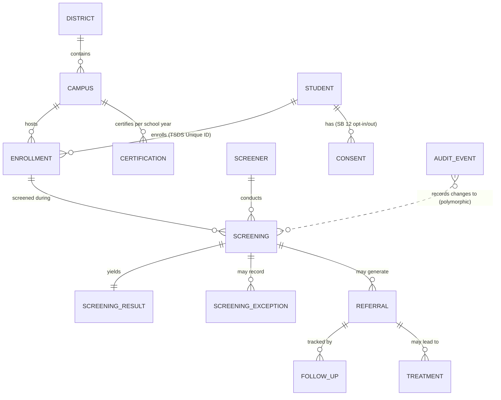

# Entity-Relationship Diagram — Statewide Vision Screening Data Collection (Sample)

Every relationship below is enforced as a named foreign key constraint in
schema.sql (ON DELETE RESTRICT). The one deliberate exception is AUDIT_EVENT,
whose entity reference is polymorphic across entity types and must survive the
deletion of what it describes; the writing service enforces its integrity.

## Reading the model

- **District, campus, student, enrollment** form the roster spine; a student's
  screenings hang off the enrollment, so a transfer student's history stays
  attached to the campus and year where each screening happened.
- **Consent** is per student (SB 12 opt-in/opt-out) and gates screening.
- **Screening** joins an enrollment to a certified screener; its result is
  one-to-one, and exceptions (absence, refusal, exemption) are recorded
  rather than left as missing data.
- **Referral, follow-up, treatment** close the loop after an abnormal result;
  a referral cannot exist without the screening that generated it.
- **Certification** is the campus's per-school-year attestation that its
  reporting is complete.
- **Audit event** carries the full before-image for controlled corrections.
