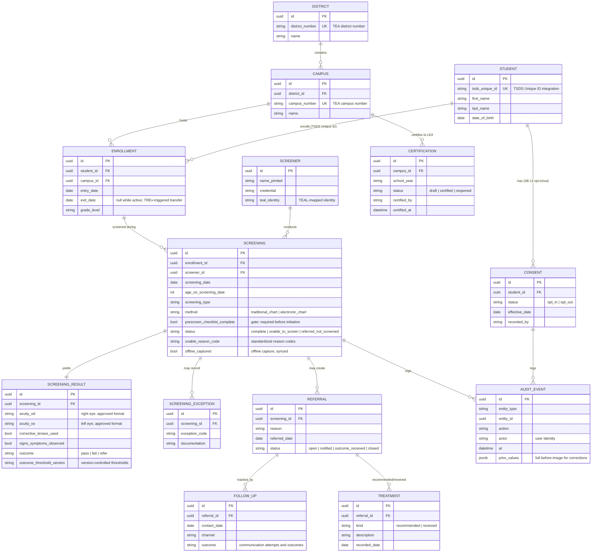

# Entity-Relationship Diagram — Statewide Vision Screening Data Collection (Sample)

## Design notes

- **Student record continuity.** `STUDENT` is identified by the TSDS Unique ID; `ENROLLMENT` carries campus/district
  attachment over time, so screening history follows the student across LEAs (TREx-standard portability) without
  manual re-entry.
- **Workflow enforcement.** `SCREENING.prescreen_checklist_complete` and required-field constraints (see `schema.sql`)
  block completion until DSHS-required elements or a documented exception are present.
- **Consent-aware reporting.** Reporting denominators derive from `CONSENT` state as of the screening date; consent
  changes are audit-logged.
- **Version-controlled thresholds.** `SCREENING_RESULT.outcome_threshold_version` pins each outcome to the threshold
  set in force, supporting controlled changes over time.
- **Auditability.** `AUDIT_EVENT` captures actor, timestamp, and prior values for every modification, supporting
  certification, controlled corrections, and audit sampling.
